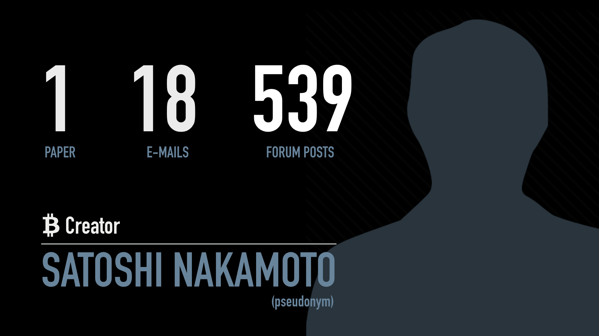
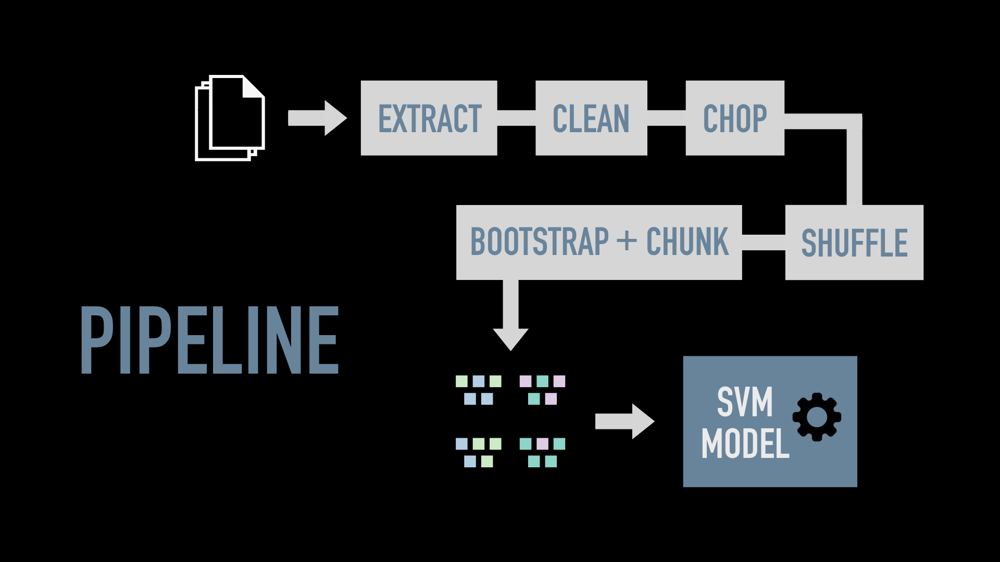
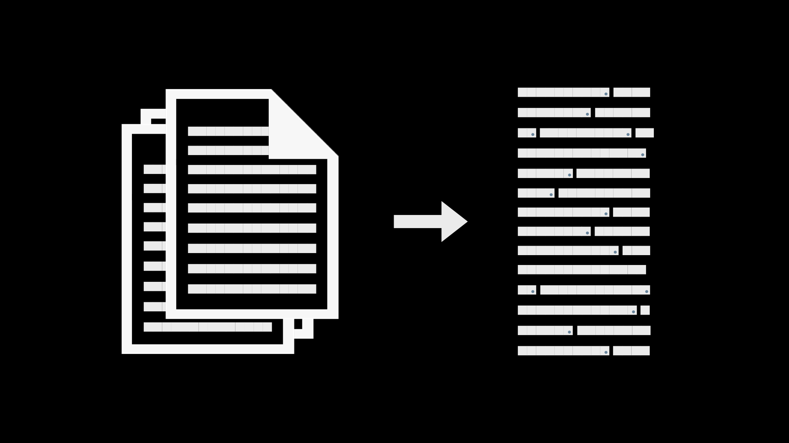
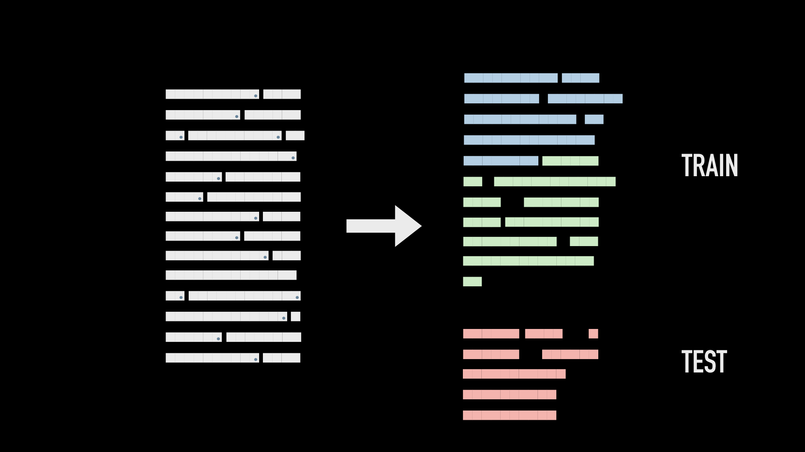
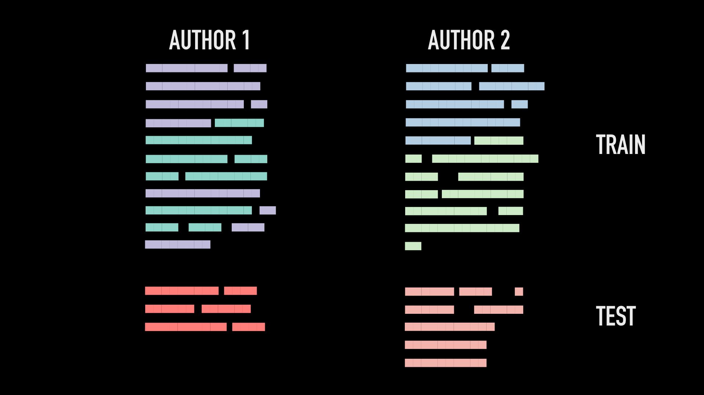
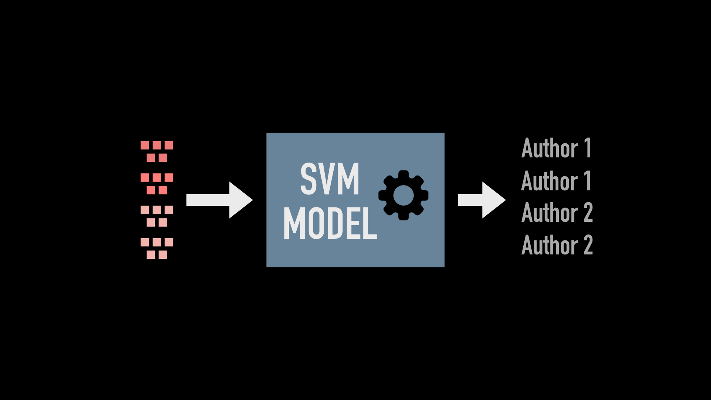
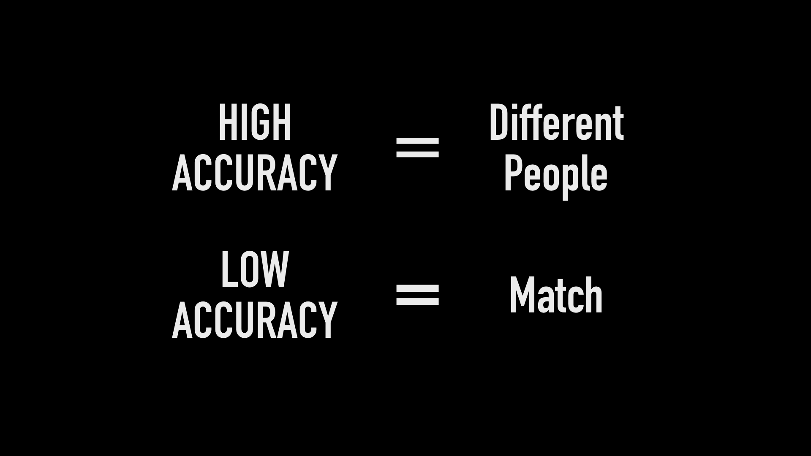
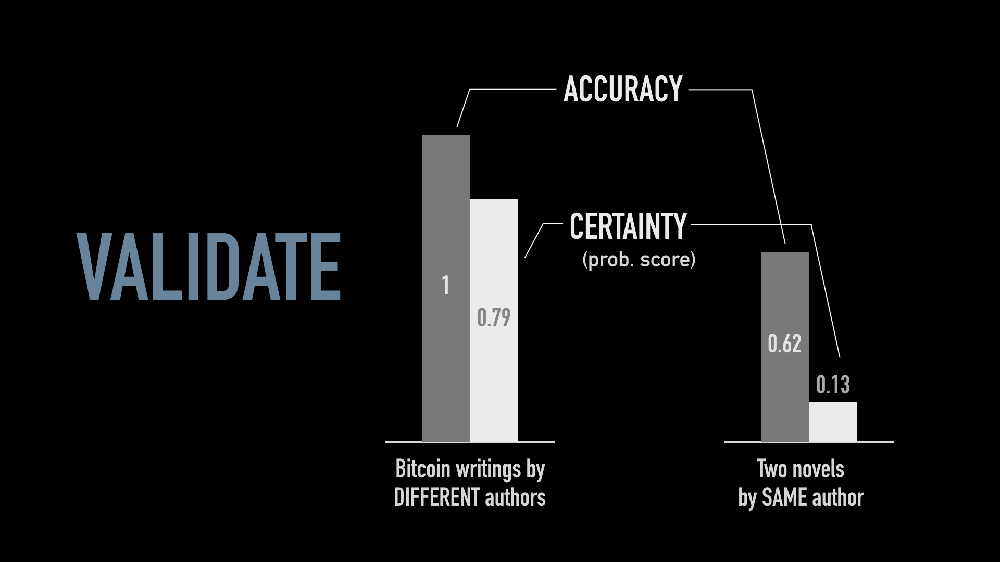
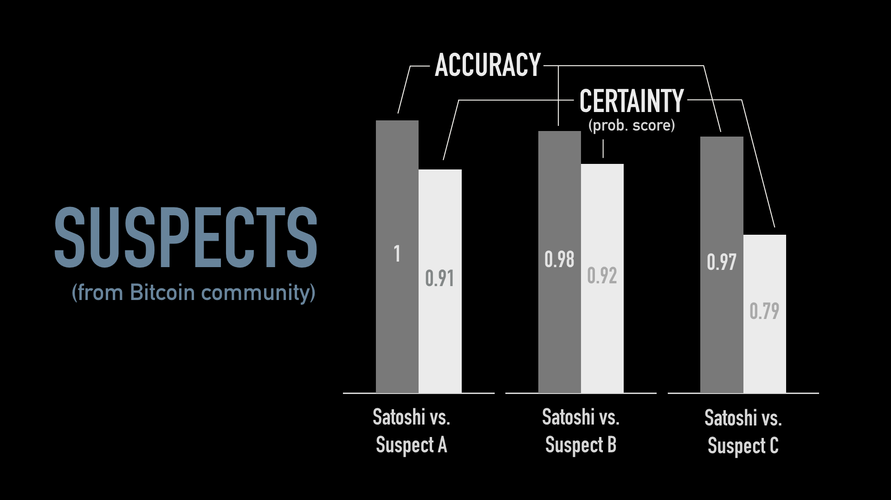

## First Model
*Mar 24, 2016*

 

The goal of this ambitious mission, as the title suggests, is to find the bitcoin creator Satoshi Nakamoto using his writings. Here I am outlining the steps I took to construct the first model, which is a key building block for a grander text comparison algorithm.

In late 2008, a person or a group of people by the pseudonym "Satoshi Nakamoto" published a white paper and a software program for a new cryptocurrency called the "bitcoin". The bitcoin went to become the world's strongest currency, trading at over 1000 USD/BTC at one point in time. The creator, however, was very secretive and vanished two years after the bitcoin’s release. Individual investigators and the media have turned up at least fifteen suspects to date but the majority have either been debunked or have denied to be Satoshi.

Satoshi hid his online traces very well, so all that was left behind were one white paper, eighteen mailing list e-mails and 539 forum posts. So for my initial investigation, I used a two-class SVM model to compare Satoshi's writings against some of the suspects'. SVM is the baseline model for text classifiaction type of problems. I did try other classifiers and indeed SVM performed the best.

This is my data pipeline:

For each author, I first extracted his writings from pdf files, cleaned the text and chopped it up into sentences.

I then randomly divided the sentences into 3 folds in preparation for a 3-fold cross validation. For each round of train-test in the 3-fold cross validation, I used two of the folds as my training set and one as my testing set.

If there was an imbalance between the amount of writing from the two authors I was comparing, I resampled on the sentence level for <i>only</i> the training set. The testing set is left untouched.

I created my samples by randomly drawing sentences until each sample had close to 500 words. Since I wanted to avoid breaking sentences, word count varied slightly from sample to sample.

From each sample, I extracted 263 features, 13 of which were stylometric features e.g. number of verbs and number of descriptive words (adjectives and adverbs), and the remaining features were word count of the most frequently used words from Author 1 (the control). The fundamental theorem I exploited here is that every person has his characteristic word usage which is independent of the topic he wrote about; it is the frequency of common stop words ("the", "of", "and", etc..) that made each writer distinct. This theorem does not hold if there are multiple writers contributing to the writing, so the big assumption I made is that Satoshi is one person. More on this later.

I let my model learn the training set samples...

...and had it classify which of the testing set samples came from which author.

The way my model is structured, a high accuracy and a high certainty indicate the authors of the samples are two different people. A low accuracy and low certainty indicate the samples came from the same author.

Here’s a quick explanation on why a low accuracy and a low certainty suggest a match:

The SVM model classifies samples by finding a hyperplane that can best separate the data. All the samples on one side of this plane are labelled as from Author 1 and all the samples on the other side are labelled as from Author 2. When samples are mixed together spatially and cannot be well-separated by a hyperplane, the model misclassifies many samples and hence for the low accuracy.

The probabilities that my SVM model assigns to each sample is an indication of how certain it is of its own predictions. For example, if my model predicts 51% chance that a sample came from Author 1 and 49% chance that this sample came from Author 2, then it is not certain of its own prediction: any slight change in the sample could swing the model's decision the other way. On the other hand, if my model predicts 99% chance that a sample came from Author 1 and 1% chance that this sample came from Author 2, then it is very certain: the difference in probability is 98%. So even though both cases are true positive, the implication is different.

Back to my pipeline. I tuned my model using a novel and a book on bitcoin so that my model was able to distinguish the bitcoin book writer from the novelist very well (one side of the spectrum), and so that it was very confused when I lied to it by throwing it two parts of the same novel (the other side of the spectrum).

Next, I validated my model using two sets of bitcoin writings from two <i>different</i> authors, and two novels by the <i>same</i> author. Results show that my model was able to distinguish the two bitcoin writers even though they wrote about the same topic; and my model was confused by the two novels, as it should have been, despite that the novels had different plots. This suggests that my model is topic insensitive, although not to the extent I would like it to be.

Finally, I tested my model on three of the suspects that the bitcoin community proposed to be Satoshi. As mentioned earlier, my approach stands only if the writings are "single origin", so I first tested Satoshi’s e-mails against his forum posts. Note that the limitation of single author is still true. From visual inspection, the formality of these two sources of writings are very similar; however, my model was able to identify the origin of the testing samples with high accuracy and high certainty, suggesting they came from different authors. I therefore decided to use only Satoshi’s white paper and mailing list e-mails when comparing with the suspects.

As the chart shows, my model was able to distinguish Satoshi from the three suspects, suggesting that these three individuals are not Satoshi. But knowing that my model is still slightly sensitive to topics, I would not rule out these people so fast yet. All my work so far is in preparation for an unmasking algorithm that will iteratively compare the writings of two authors, each time removing the strongest feature from the previous iteration. The faster the accuracy drops, the faster the two authors become indistinguishable and the more likely they are the same person. But before I do anything, I need to go back and polish my data cleaning process and tune my model to more writings to further remove its topic sensitivity. Then with this better model I apply the unmasking technique and see how these three suspects perform.

## Toolkit
Second version of the code with 3-fold cross validation can be found in [v2-cross-val](../v2-cross-val). Here is a list of its dependencies:
* Python (numpy, pandas)
* MongoDB
* Postgres
* spaCy
* textract

Raw data is not available in this repo.
